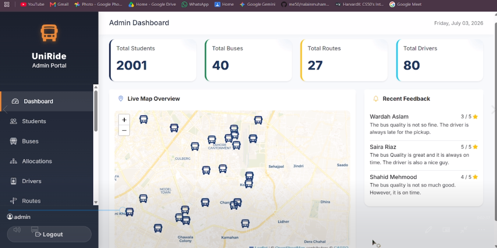
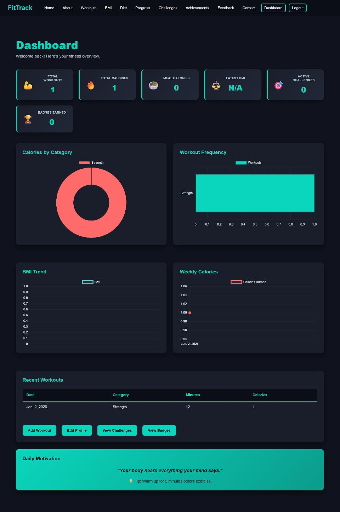

# Hi, I'm Laiba Asif 👋

**Data Science Undergraduate | Aspiring Data Analyst | Python Developer**

📍 Lahore, Punjab, Pakistan · 🎓 UET Lahore, Class of 2029

<!-- Upload your photo as assets/profile.jpg, then uncomment:

-->

## About Me

I'm a BS Data Science student at the University of Engineering and Technology, Lahore, with an interest in data analysis, machine learning, and artificial intelligence. I build practical applications using Python and explore how thoughtful software design and structured databases solve everyday problems. My projects include fitness management applications and a collaborative campus transport system. I enjoy learning through hands-on projects, strengthening my analytical skills, and collaborating with other learners.

- 🔭 **Project experience:** UniRide, FitTrack, and a Gym Management System.
- 🌱 **Learning focus:** statistical modeling, data handling, and machine learning algorithms.
- 🐍 **Completed:** Harvard's CS50 Introduction to Programming with Python and a remote Python internship at DecodeLabs.
- 🤝 **Open to:** student projects, learning opportunities, and collaboration in data science and software development.

## Skills and Technologies

### Languages and Frameworks

| Category | Skills and Technologies |
| --- | --- |
| Programming | Python, C#, SQL |
| Web Development | Django, ASP.NET Core MVC, HTML, CSS |
| Databases | Microsoft SQL Server, relational database design, normalization |
| Data Access | Entity Framework Core, Code-First approach, CRUD operations |
| Python Development | Object-oriented programming, functions, exception handling, file I/O, regular expressions |
| Testing | Automated unit testing with pytest |
| SQL | Filtering, aggregation, GROUP BY, HAVING, JOINs, UNION |
| Collaboration | Teamwork, communication, analytical thinking, problem-solving |
| Currently Learning | Statistical modeling, data handling, machine learning |

## Featured Projects

### 🚌 UniRide — Campus Transport Management System

A collaborative university project that brings campus transport management into one application, developed for Object-Oriented Programming and Database Systems coursework.

- **Features:** live bus tracking with SignalR, QR code attendance, and student allocation based on route capacity and demand.
- **Database:** a normalized schema with 15 tables, integrated through Entity Framework Core.
- **Technologies:** C#, ASP.NET Core MVC, Microsoft SQL Server, Entity Framework Core, SignalR.
- **Team:** Laiba Asif, Nalain Muhammad, Mubashira Aqeel, and Kinza Rehman.

[Source Code — link shared in my LinkedIn post](https://github.com/LaibaAsif04/UniRide-CTMS)

### 💪 FitTrack — Fitness Web Application

A web application for managing personal fitness activities, tracking progress, and organizing workouts and diet plans.

- **Features:** account registration and authentication, fitness profiles, workout logging, BMI tracking, and diet recommendations based on fitness goals.
- **Insights:** dashboards for workouts, calories burned, BMI history, and weekly or monthly progress.
- **Technologies:** Python, Django, HTML, CSS; CRUD operations, forms, and database relationships.

<!-- Replace the URL with your actual repository link, then uncomment:
[Source Code](REPLACE_WITH_FITTRACK_REPOSITORY_URL)
-->

## Education

### Bachelor of Science in Data Science

**University of Engineering and Technology, Lahore** 
**Dates:** 2025–2029 
**Expected Graduation:** 2029

### Intermediate — ICS

**Punjab Group of Colleges** 
**Dates:** April 2023–July 2025 
**Grade:** A

### Matriculation — Biology

**Pak Model Foundation High School** 
**Dates:** March 2010–April 2023 
**Grade:** A

## Experience

### Python Programming Intern — DecodeLabs

**Remote · Completed**

Developed practical Python applications, gained experience in programmatic data management and problem-solving, and participated in mentor-led sessions connecting academic concepts with software development practices.

<!-- Add exact internship dates after checking your certificate or offer letter. -->

## Certifications and Course Completions

| Credential | Provider | Focus |
| --- | --- | --- |
| CS50's Introduction to Programming with Python | Harvard University / CS50 | Python, OOP, pytest, regular expressions, file I/O, and a final project |
| Introduction to SQL Server | DataCamp | SQL queries, filtering, aggregation, joins, and database operations |
| Python Programming Internship — Certificate of Completion | DecodeLabs | Practical Python development, data management, and problem-solving |

## Let's Connect

I'm happy to connect with students and professionals interested in data science, Python development, and practical software projects.

- **LinkedIn:** [Laiba Asif](https://www.linkedin.com/in/laiba-asif-5a282039b/)

- **GitHub:** [GitHub Profile](https://github.com/LaibaAsif04)
- **Email:** (mailto:laibaasif04092007@gmail.com)
